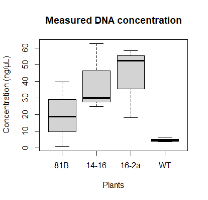
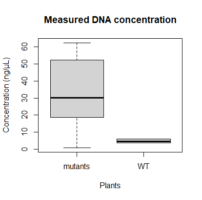

# ZWO
Codes used in the a ZWO project

**RcodeBoxplotApart.R codes for graph**

  

This boxplot depicts measured DNA concentrations (ng/µL) in function of different mutant and WT lines.

**RcodeBoxplot.R codes for graph**

  
  
This boxplot groups all the mutant data into one box to make the difference between mutant and WT clear
